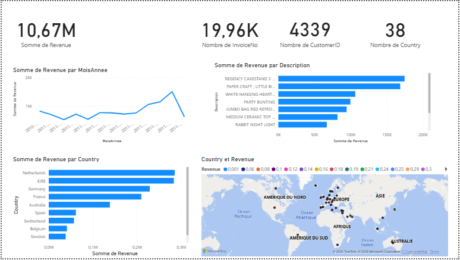

# Mini-Projet — Dashboard Power BI 📊



## Contexte
Ce mini-projet reprend le dataset UCI Online Retail, déjà exploré en Pandas (Projet 1),
Streamlit (Projet 2) et SQL (Projet 3), pour démontrer la maîtrise d'un outil de
Business Intelligence low-code très demandé sur le marché : **Power BI**.

Power BI est connecté **directement à la base PostgreSQL** (`retail_db`) construite
dans le Projet 3 — aucune donnée n'a été re-téléchargée ou re-nettoyée manuellement.

## Visuels inclus
| Visuel | Insight |
|---|---|
| 4 KPIs | Revenu total (£10.67M), 19.96K commandes, 4339 clients, 38 pays |
| Évolution du CA mensuel | Pic de revenu en novembre 2011 (saisonnalité Noël) |
| Top 10 produits | REGENCY CAKESTAND 3 TIER en tête, frais de port exclus |
| Top pays hors UK | Pays-Bas et EIRE dominent l'international |
| Carte mondiale | Répartition géographique des ventes sur 38 pays |

## Compétences démontrées
- Connexion Power BI ↔ PostgreSQL (source de données live)
- Création de colonnes calculées en **DAX** (`FORMAT`, `YEAR`, `MONTH`)
- Tri personnalisé d'axe chronologique (Trier par colonne)
- Filtres avancés (Premiers N, exclusions manuelles)
- Mise en page d'un rapport BI multi-visuels

## Stack technique
![PostgreSQL]
![Power BI]
![DAX]

## Structure du repo
```
mini-projet-powerbi/
├── dashboard_retail.pbix     — Fichier Power BI source
├── dashboard_powerbi.png     — Capture du rapport complet
└── README.md
```

> Le fichier `.pbix` nécessite Power BI Desktop et une connexion à `retail_db`
> (voir Projet 3) pour être réouvert avec les données live.

## Auteur
**Shanice Marvin Tiogang** · Business Analytics & Data Science · Tunis
